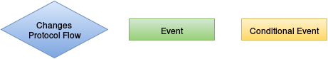
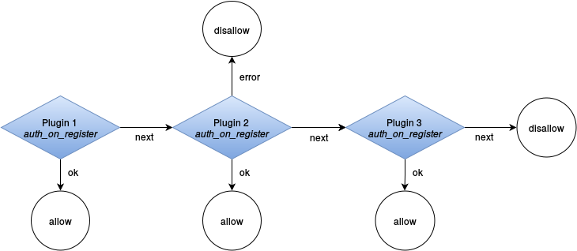
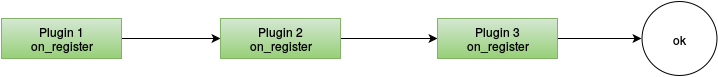
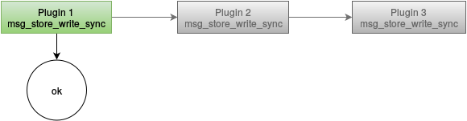
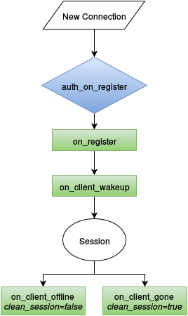
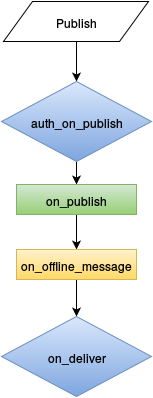
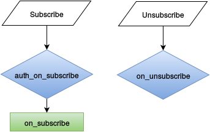

.. _plugin_development:

Plugin Development Guide
========================

VerneMQ is implemented in Erlang OTP and therefore runs on top of the Erlang VM.
For this reason plugins have to be developed in a programming language that runs
on the Erlang VM. The most popular choice is obviously the Erlang programming
language itself, but Elixir or Lisp flavoured Erlang LFE could be used too. 

.. danger::

    Be aware that in VerneMQ a plugin does NOT run in a sandboxed environment
    and misbehaviour could seriously harm the system (e.g. performance degradation,
    reduced availability as well as consistency, and message loss).

    Get in touch with us in case you require a review of your plugin.

This guide explains the different flows that expose different hooks to be
used for custom plugins. It also describes the code structure a plugin must
comply to in order to be successfully loaded and started by the VerneMQ plugin mechanism. 

All the hooks that are currently exposed fall into one of three categories. 

1. Hooks that allow you to change the protocol flow. An example could be to
   authenticate a client using the ``auth_on_register`` hook.

2. Hooks that inform you about a certain action, that could be used for example
   to implement a custom logging or audit plugin.

3. Hooks that are called given a certain condition

Before going into the details, let's give a quick intro to the VerneMQ plugin system.

Plugin System
-------------

The VerneMQ plugin system allows you to load, unload, start and stop plugins during
runtime, and you can even upgrade a plugin during runtime. To make this work it is
required that the plugin is an OTP application and strictly follows
the rules of implementing the Erlang OTP application behaviour. It is recommended
to use the ``rebar3`` toolchain to compile the plugin. VerneMQ comes with built-in
support for the directory structure used by ``rebar3``. 

Every plugin has to describe the hooks it is implementing as part of its application 
environment file. The ``vmq_acl`` plugin for instance comes with the application 
environment file below:

.. code-block:: erlang
   :linenos:
   :emphasize-lines: 6,7,8,9,10,16,17,18,19,20

    {application, vmq_acl,
     [
      {description, "Simple File based ACL for VerneMQ"},
      {vsn, git},
      {registered, []},
      {applications, [
                      kernel,
                      stdlib,
                      clique
                     ]},
      {mod, { vmq_acl_app, []}},
      {env, [
          {file, "priv/test.acl"},
          {interval, 10},
          {vmq_config_enabled, true},
          {vmq_plugin_hooks, [
                {vmq_acl, change_config, 1, [internal]},
                {vmq_acl, auth_on_publish, 6, []},
                {vmq_acl, auth_on_subscribe, 3, []}
            ]}
        ]}
     ]}.

Lines 6 to 10 instruct the plugin system to ensure that those dependent applications
are loaded and started. If you're using third party dependencies make sure that they are
available in compiled form and part of the plugin load path. Lines 16 to 20 allow the plugin 
system to compile the plugin rules. Yes, you've heard correctly. The rules are compiled
into Erlang VM code to make sure the lookup and execution of plugin code is as fast as
possible. Some hooks exist which are used internally such as the ``change_config/1``, we'll
describe those at some other point.

The environment value for ``vmq_plugin_hooks`` is a list of hooks. A hook is specified
by ``{Module, Function, Arity, Options}``.

To streamline the plugin development we provide a different Erlang behaviour for 
every hook a plugin implements. Those behaviour are part of the ``vmq_commons``
library application, which you should add as a dependency to your plugin. ``vmq_commons``
also comes with a header file that contains all the type definitions used by the
hooks.

Chaining
~~~~~~~~

It is possible to have multiple plugins serving the same hook. 
Depending on the hook the plugin chain is used differently.
The most elaborate chains can be found for the hooks that deal with authentication
and authorization flows. We also call them *conditional chains* as a plugin can give 
control away to the next plugin in the chain. The image show a sample plugin chain
for the ``auth_on_register`` hook.

Most hooks don't require conditions and are mainly used as event handlers.
In this case all plugins in a chain are called. An example for such a hook would be
the ``on_register`` hook.

A rather specific case is the need to call only one 
plugin instead of iterating through the whole chain. VerneMQ uses such hooks for
it's pluggable message storage system.

Unless you're implementing your custom message storage backend, you probably won't need
this style of hook.

.. note::

    The position in the plugin call chain is currently 
    implicitly given by the order the plugins have been started. 

Startup
~~~~~~~

The plugin mechanism uses the application environment file to infer the applications 
that it has to load and start prior to starting the plugin itself. It internally uses 
the ``application:ensure_all_started/1`` function call to start the plugin. If your
setup is more complex you could override this behaviour by implementing a custom 
``start/0`` function inside a module that's named after your plugin.

Teardown
~~~~~~~~

The plugin mechanism uses ``application:stop/1`` to stop and unload the plugin. This won't stop
the dependent application started at startup. If you rely on third party applications
that aren't started as part of the VerneMQ release, e.g. a database driver, you can
implement a custom ``stop/0`` function inside a module that's named after your plugin and
properly stop the driver there. 

vmq_plugin.conf
~~~~~~~~~~~~~~~

Whenever a plugin is started or stopped via ``vmq-admin plugin enable|disable`` the 
``vmq_plugin.conf`` file gets updated. ``vmq-admin`` is the only supported way
to start and stop plugins during runtime. The ``vmq_plugin.conf`` that comes with
the default VerneMQ release looks like this:

.. code-block:: erlang
   :linenos:

    {plugins,[{application,vmq_systree,[]},
              {application,vmq_passwd,[]},
              {application,vmq_acl,[]}]}.

This example ``vmq_plugin.conf`` ensures that the plugins ``vmq_systree``, ``vmq_passwd``,
and ``vmq_acl`` are started during the boot of VerneMQ. VerneMQ itself, namely the 
``vmq_server`` application registers its own plugins for configuration and message
storage as part of the boot process. The resulting ``vmq_plugin.conf`` after VerneMQ
has successfully started will look like  this:

.. code-block:: erlang
   :linenos:

   {plugins,[{application,vmq_systree,[]},
             {application,vmq_passwd,[]},
             {application,vmq_acl,[]},
             {module,vmq_config,[{hooks,[{change_config,change_config,1}]}]},
             {module,vmq_lvldb_store,
                     [{hooks,[{msg_store_write,msg_store_write,2}]}]},
             {module,vmq_lvldb_store,
                     [{hooks,[{msg_store_delete,msg_store_delete,2}]}]},
             {module,vmq_lvldb_store,
                     [{hooks,[{msg_store_find,msg_store_find,1}]}]},
             {module,vmq_lvldb_store,
                     [{hooks,[{msg_store_read,msg_store_read,2}]}]}]}.

If you're developing a plugin for VerneMQ keep the ``vmq_plugin.conf`` in mind as 
it contains the main structure that is used to compile the plugin rules at runtime. 
In case you hit an issue with the startup of VerneMQ it is possible that an 
autostarted plugin is causing the issue. Feel free to edit ``vmq_plugin.conf`` manually if 
VerneMQ is stopped, but never edit the file manually if VerneMQ is running.

Public Type Specs
-----------------

The ``vmq_types.hrl`` exposes all the type specs used by the hooks. The following
types are used by the plugin system:

.. code-block:: erlang
   :linenos:

    -type peer()                :: {inet:ip_address(), inet:port_number()}.
    -type username()            :: binary() | undefined.
    -type password()            :: binary() | undefined.
    -type client_id()           :: binary().
    -type mountpoint()          :: string().
    -type subscriber_id()       :: {mountpoint(), client_id()}.
    -type reg_view()            :: atom().
    -type topic()               :: [binary()].
    -type qos()                 :: 0 | 1 | 2.
    -type routing_key()         :: [binary()].
    -type payload()             :: binary().
    -type flag()                :: boolean().

Session Lifecycle
-----------------

VerneMQ provides multiple hooks throughout the lifetime of a session. 
The most important one is the ``auth_on_register``which acts as an application 
level firewall granting or rejecting new clients.

auth_on_register
~~~~~~~~~~~~~~~~

The ``auth_on_register`` hook allows your plugin to grant or reject new client
connections. Moreover it lets you exert fine grained control over the configuration
of the client session. The hook is specified in the Erlang behaviour ``auth_on_register_hook``
available in ``vmq_commons``.

.. code-block:: erlang
   :linenos:

    -module(auth_on_register_hook).
    -include("vmq_types.hrl").
    
    -type reg_modifiers()   :: {mountpoint, mountpoint()}
                             | {subscriber_id, subscriber_id()}
                             | {reg_view, reg_view()}
                             | {clean_session, flag()}
                             | {max_message_size, non_neg_integer()}
                             | {max_message_rate, non_neg_integer()}
                             | {max_inflight_messages, non_neg_integer()}
                             | {retry_interval, pos_integer()}
                             | {upgrade_qos, boolean()}
                             | {trade_consistency, boolean()}.
    
    %% called as an all_till_ok hook
    -callback auth_on_register(Peer          :: peer(),
                               SubscriberId  :: subscriber_id(),
                               UserName      :: username(),
                               Password      :: password(),
                               CleanSession  :: flag()
                               ) -> ok
                                    | {ok, [reg_modifiers()]}
                                    | {error, invalid_credentials | any()}
                                    | next.

Every plugin that implements the ``auth_on_register`` hook is part of a conditional 
plugin chain. For this reason we allow the hook to return different values 
depending on how the plugin grants or rejects this client. In case the plugin 
doesn't know the client it is best to return ``next`` as this would allow 
subsequent plugins in the chain to validate this client. If no plugin is able to 
validate the client it gets automatically rejected.

on_register
~~~~~~~~~~~

The ``on_register`` hook allows your plugin to get informed about a newly authenticated
client. The hook is specified in the Erlang behaviour ``on_register_hook`` available
in ``vmq_commons``.

.. code-block:: erlang
   :linenos:

    -module(on_register_hook).
    -include("vmq_types.hrl").
    
    %% called as an 'all' hook, return value is ignored
    -callback on_register(Peer          :: peer(),
                          SubscriberId  :: subscriber_id(),
                          UserName      :: username()) -> any().

on_client_wakeup
~~~~~~~~~~~~~~~~

Once a new client was successfully authenticated and the above described hooks have
been called, the client attaches to its queue. If it is a returning client
using ``clean_session=false`` or if the client had previous sessions in the cluster, this
process could take a while. (As offline messages are migrated to a new node, existing 
sessions are disconnected). The ``on_client_wakeup`` hook is called at the point
where a queue has been successfully instantiated, possible offline messages migrated, and
potential duplicate sessions have been disconnected. In other words: when the client has reached 
a completely initialized, normal state for accepting messages.
The hook is specified in the Erlang behaviour ``on_client_wakeup_hook`` available in ``vmq_commons``.

.. code-block:: erlang
   :linenos:

    -module(on_client_wakeup_hook).
    -include("vmq_types.hrl").
    
    %% called as an 'all'-hook, return value is ignored
    -callback on_client_wakeup(SubscriberId  :: subscriber_id()) -> any().

on_client_offline
~~~~~~~~~~~~~~~~~

This hook is called if a client using ``clean_session=false`` closes the connection 
or gets disconnected by a duplicate client. The hook is specified in the Erlang
behaviour ``on_client_offline_hook`` available in ``vmq_commons``.

.. code-block:: erlang
   :linenos:

    -module(on_client_offline_hook).
    -include("vmq_types.hrl").
    
    %% called as an 'all'-hook, return value is ignored
    -callback on_client_offline(SubscriberId  :: subscriber_id()) -> any().

on_client_gone
~~~~~~~~~~~~~~

This hook is called if a client using ``clean_session=true`` closes the connection 
or gets disconnected by a duplicate client. The hook is specified in the Erlang
behaviour ``on_client_gone_hook`` available in ``vmq_commons``.

.. code-block:: erlang
   :linenos:

    -module(on_client_gone_hook).
    -include("vmq_types.hrl").
    
    %% called as an 'all'-hook, return value is ignored
    -callback on_client_gone(SubscriberId  :: subscriber_id()) -> any().

Publish Flow
------------

In this section the publish flow is described. VerneMQ provides multiple hooks
throughout the flow of a message. The most important one is the ``auth_on_publish``
which acts as an application level firewall granting or rejecting a publish message.

auth_on_publish
~~~~~~~~~~~~~~~

The ``auth_on_publish`` hook allows your plugin to grant or reject publish requests
sent by a client. It also enables to rewrite the publish topic, payload, qos, or 
retain flag. The hook is specified in the Erlang behaviour ``auth_on_publish_hook``
available in ``vmq_commons``.

.. code-block:: erlang
   :linenos:

    -module(auth_on_publish_hook).
    -include("vmq_types.hrl").

    -type msg_modifier() :: {topic, topic()}
                          | {payload, payload()}
                          | {reg_view, reg_view()}
                          | {qos, qos()}
                          | {retain, flag()}
                          | {mountpoint, mountpoint()}.
    
    -callback auth_on_publish(UserName      :: username(),
                              SubscriberId  :: subscriber_id(),
                              QoS           :: qos(),
                              Topic         :: topic(),
                              Payload       :: payload(),
                              IsRetain      :: flag()
                              ) -> ok
                                   | {ok, Payload    :: payload()}
                                   | {ok, Modifiers  :: [msg_modifier()]}
                                   | {error, Reason  :: any()}
                                   | next.

Every plugin that implements the ``auth_on_publish`` hook is part of a conditional 
plugin chain. For this reason we allow the hook to return different values. In case the plugin 
can't validate the publish message it is best to return ``next`` as this would allow 
subsequent plugins in the chain to validate the request. If no plugin is able to 
validate the request it gets automatically rejected.
    
on_publish
~~~~~~~~~~

The ``on_publish`` hook allows your plugin to get informed about an authorized
publish message. The hook is specified in the Erlang behaviour ``on_publish_hook`` 
available in ``vmq_commons``.

.. code-block:: erlang
   :linenos:

    -module(on_publish_hook).
    -include("vmq_types.hrl").
    
    %% called as an 'all'-hook, return value is ignored
    -callback on_publish(UserName      :: username(),
                         SubscriberId  :: subscriber_id(),
                         QoS           :: qos(),
                         Topic         :: topic(),
                         Payload       :: payload(),
                         IsRetain      :: flag()) -> any().

on_offline_message
~~~~~~~~~~~~~~~~~~

The ``on_offline_message`` hook allows your plugin to get notified about a new
a queued message for a client that is currently offline. The hook is specified in 
the Erlang behaviour ``on_offline_message_hook`` available in ``vmq_commons``.

.. code-block:: erlang
   :linenos:

    -module(on_offline_message_hook).
    -include("vmq_types.hrl").
    
    %% called as an 'all'-hook, return value is ignored
    -callback on_offline_message(SubscriberId  :: subscriber_id()) -> any().

on_deliver
~~~~~~~~~~

The ``on_deliver`` hook allows your plugin to get informed about outgoing 
publish messages, but also allows you to rewrite topic and payload of the outgoing
message. The hook is specified in the Erlang behaviour ``on_deliver_hook`` available
in ``vmq_commons``.

.. code-block:: erlang
   :linenos:

    -module(on_deliver_hook).
    -include("vmq_types.hrl").
    -type msg_modifier() :: {topic, topic()}
                          | {payload, payload()}.
    
    -callback on_deliver(UserName      :: username(),
                         SubscriberId  :: subscriber_id(),
                         Topic         :: topic(),
                         Payload       :: payload()
                         ) -> ok
                               | {ok, Payload    :: payload()}
                               | {ok, Modifiers  :: [msg_modifier()]}
                               | next.

Every plugin that implements the ``on_deliver`` hook is part of a conditional 
plugin chain, although NO verdict is required in this case. The message gets
delivered in any case. If your plugin uses this hook to rewrite the message the
plugin system stops evaluating subsequent plugins in the chain.
    

Subscription Flow
-----------------

In this section the subscription flow is described. VerneMQ provides several hooks
to intercept the subscription flow. The most important one is the ``auth_on_subscribe``
which acts as an application level firewall granting or rejecting subscribe requests.

auth_on_subscribe
~~~~~~~~~~~~~~~~~

The ``auth_on_subscribe`` hook allows your plugin to grant or reject subscribe requests
sent by a client. It also enables to rewrite the subscribe topic and qos. The hook 
is specified in the Erlang behaviour ``auth_on_subscribe_hook`` available in ``vmq_commons``.

.. code-block:: erlang
   :linenos:
   
    -module(auth_on_subscribe_hook).
    -include("vmq_types.hrl").
    
    %% called as an all_till_ok - hook
    -callback auth_on_subscribe(UserName      :: username(),
                                SubscriberId  :: subscriber_id(),
                                Topics        :: [{Topic :: topic(), QoS :: qos()}]
                                ) -> ok
                                     | {ok, [{Topic :: topic(), Qos :: qos()}]}
                                     | {error, Reason :: any()}
                                     | next.

on_subscribe
~~~~~~~~~~~~

The ``on_subscribe`` hook allows your plugin to get informed about an authorized
subscribe request. The hook is specified in the Erlang behaviour ``on_subscribe_hook`` 
available in ``vmq_commons``.

.. code-block:: erlang
   :linenos:

    -module(on_subscribe_hook).
    -include("vmq_types.hrl").
    
    %% called as an 'all'-hook, return value is ignored
    -callback on_subscribe(UserName      :: username(),
                           SubscriberId  :: subscriber_id(),
                           Topics        :: [{Topic :: topic(), QoS :: qos()}]) -> any().
    
on_unsubscribe
~~~~~~~~~~~~~~

The ``on_unsubscribe`` hook allows your plugin to get informed about an unsubscribe 
request. It also allows you to rewrite the unsubscribe topic if required. The hook 
is specified in the Erlang behaviour ``on_unsubscribe_hook`` available in ``vmq_commons``.

.. code-block:: erlang
   :linenos:

    -module(on_unsubscribe_hook).
    -include("vmq_types.hrl").
    
    %% called as an 'all'-hook, return value is ignored
    -callback on_unsubscribe(UserName      :: username(),
                             SubscriberId  :: subscriber_id(),
                             Topics        :: [Topic :: topic()]
                             ) -> ok
                                  | {ok, [Topic :: topic()]}
                                  | next.

Erlang Boilerplate
------------------

We recommend to use the ``rebar3`` toolchain to generate the basic Erlang OTP application
boilerplate and start from there.

.. code-block:: shell

    rebar3 new app name="myplugin" desc="this is my first VerneMQ plugin"
    ===> Writing myplugin/src/myplugin_app.erl
    ===> Writing myplugin/src/myplugin_sup.erl
    ===> Writing myplugin/src/myplugin.app.src
    ===> Writing myplugin/rebar.config
    ===> Writing myplugin/.gitignore
    ===> Writing myplugin/LICENSE
    ===> Writing myplugin/README.md

Change the ``rebar.config`` file to include the ``vmq_commons`` dependency:

.. code-block:: erlang

    {erl_opts, [debug_info]}.
    {deps, [{vmq_commons, ".*", 
        {git, "git://github.com/erlio/vmq_commons.git", {branch, "master"}}}
    ]}.
    
Compile the application, this will automatically fetch ``vmq_commons``.

.. code-block:: shell

    rebar3 compile                             
    ===> Verifying dependencies...
    ===> Fetching vmq_commons ({git,
                                          "git://github.com/erlio/vmq_commons.git",
                                          {branch,"master"}})
    ===> Compiling vmq_commons
    ===> Compiling myplugin

Now you're ready to implement the hooks. Don't forget to add the proper ``vmq_plugin_hooks``
entries to your ``src/myplugin.app.src`` file.
